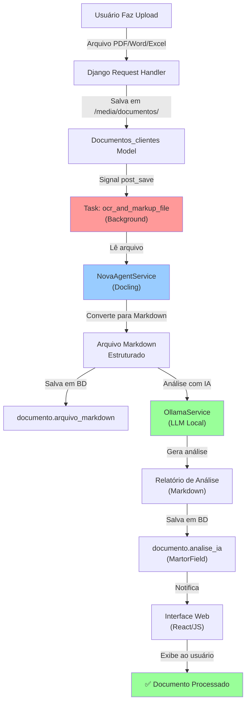

# 🔄 Pipeline OCR & Processamento de Documentos

Documentação técnica detalhada do pipeline de OCR (Optical Character Recognition) e processamento de documentos com IBM Docling, Ollama e RAG.

---

## 📊 Visão Geral do Pipeline



---

## 🏗️ Arquitetura de Componentes

### 1. **Django Model Layer** (`src/app/user/models.py`)

Define o estrutura de armazenamento:

```python
class Documentos_clientes(models.Model):
    id = UUIDField(primary_key=True)
    cliente = ForeignKey(Clientes)
    arquivo = FileField(upload_to='documentos/%Y/%m/%d')
    arquivo_markdown = FileField(upload_to='documentos/md/%Y/%m/%d')
    analise_ia = MartorField()  # Markdown field com preview
    data_cadastro = DateField(auto_now_add=True)
```

**Campo `arquivo_markdown`:** Armazena a conversão Markdown gerada pelo Docling

**Campo `analise_ia`:** Armazena a análise gerada pela IA (Ollama)

---

### 2. **Signal Dispatcher** (`src/app/user/models.py`)

Quando um documento é criado, um signal dispara automaticamente:

```python
from django.db.models.signals import post_save
from django.dispatch import receiver

@receiver(post_save, sender=Documentos_clientes)
def trigger_ocr_task(sender, instance, created, **kwargs):
    """
    Quando um novo Documentos_clientes é criado,
    dispara a background task de OCR
    """
    if created:  # Apenas para novos documentos
        from app.nova.tasks import ocr_and_markup_file
        ocr_and_markup_file(instance.id)
```

**Vantagem:** Desacoplamento entre a requisição HTTP e o processamento pesado

---

### 3. **Background Task** (`src/app/nova/tasks.py`)

Executa o processamento sem travar a UI:

```python
def ocr_and_markup_file(instance_id):
    """
    Background Task: Triggers layout analysis, OCR and deep GFM conversion 
    via Docling/Fallbacks and generates the AI Analysis report card.
    """
    logger.info(f"Iniciando OCR para documento ID: {instance_id}")
    
    try:
        # 1. Recupera o documento
        instance = get_object_or_404(Documentos_clientes, pk=instance_id)
        
        # 2. Processa o arquivo
        process_document_file(instance)
        
        logger.info(f"Processamento concluído: {instance.nome}")
    except Exception as e:
        logger.error(f"Erro crítico: {e}", exc_info=True)
        raise e
```

---

### 4. **NovaAgentService** (`src/app/nova/services.py`)

Core do processamento OCR usando IBM Docling:

```python
class NovaAgentService:
    """
    Serviço central do agente Nova para processamento de documentos.
    """
    
    def __init__(self):
        from docling.document_converter import DocumentConverter
        self.converter = DocumentConverter()
    
    def process_document(self, file_path):
        """
        Usa IBM Docling para converter um arquivo em Markdown estruturado.
        
        Suporte:
        - PDF (com detecção de layout)
        - Word (.docx)
        - Excel (.xlsx)
        - CSV
        - Markdown (.md)
        
        Returns:
            str: Documento em Markdown ou string de erro
        """
        logger.info(f"[Docling] Iniciando conversão: {file_path}")
        
        try:
            result = self.converter.convert(file_path)
            markdown_text = result.document.export_to_markdown()
            
            if markdown_text and markdown_text.strip():
                logger.info("[Docling] Conversão bem-sucedida")
                return markdown_text
            else:
                logger.warning("[Docling] Documento vazio após conversão")
                return ""
        
        except Exception as e:
            logger.error(f"[Docling] Erro na conversão: {e}", exc_info=True)
            raise e
```

**O que o Docling faz:**
- 🎯 Detecta layout (headers, tabelas, listas)
- 📄 Extrai texto com preservação de estrutura
- 🖼️ Detecta figuras e diagramas
- 📊 Converte tabelas em Markdown
- 🔤 Preserva formatação (negrito, itálico)

---

### 5. **Extractors para Diferentes Formatos** (`src/app/user/services.py`)

Função principal que orquestra a extração:

```python
def process_document_file(documento):
    """
    Orquestra o processamento de um documento,
    escolhendo o extrator apropriado baseado na extensão.
    """
    extensao = documento.extensao.lower()
    
    file_path = documento.arquivo.path
    markdown_content = None
    
    # 1. Determina qual extrator usar
    if extensao == '.pdf':
        markdown_content = extract_pdf(file_path)
    elif extensao == '.docx':
        markdown_content = extract_docx(file_path)
    elif extensao == '.xlsx' or extensao == '.xls':
        markdown_content = extract_excel(file_path)
    elif extensao == '.csv':
        markdown_content = extract_csv(file_path)
    elif extensao == '.md':
        markdown_content = extract_markdown(file_path)
    
    # 2. Salva o Markdown
    if markdown_content:
        md_filename = f"{documento.id}.md"
        documento.arquivo_markdown.save(
            md_filename,
            ContentFile(markdown_content.encode())
        )
    
    # 3. Gera análise com IA (Ollama)
    if markdown_content:
        analise_ia = generate_ai_analysis(markdown_content)
        documento.analise_ia = analise_ia
    
    # 4. Salva tudo
    documento.save()
```

---

#### 5.1 Extrator de PDFs

```python
def extract_pdf(file_path):
    """
    Extrai texto de PDF com dois níveis:
    1. Tenta IBM Docling (resultado melhor)
    2. Fallback para pypdf (compatibilidade)
    """
    
    # Nível 1: Nova Agent + Docling
    try:
        agent = NovaAgentService()
        markdown = agent.process_document(file_path)
        if markdown:
            return markdown
    except Exception as e:
        logger.warning(f"Docling falhou, usando fallback: {e}")
    
    # Nível 2: pypdf (fallback)
    import pypdf
    try:
        reader = pypdf.PdfReader(file_path)
        text_parts = []
        for i, page in enumerate(reader.pages):
            text = page.extract_text()
            if text:
                text_parts.append(f"## --- Página {i + 1} ---\n\n{text}")
        return "\n\n".join(text_parts) if text_parts else "PDF vazio"
    except Exception as e:
        logger.error(f"Erro na extração: {e}")
        return f"Falha na extração: {str(e)}"
```

---

#### 5.2 Extrator de Excel

```python
def extract_excel(file_path):
    """
    Converte planilhas Excel em tabelas Markdown formatiadas.
    """
    import openpyxl
    
    wb = openpyxl.load_workbook(file_path, data_only=True)
    md_parts = []
    
    for sheet_name in wb.sheetnames:
        sheet = wb[sheet_name]
        md_parts.append(f"### 📊 Aba: {sheet_name}\n")
        
        rows = list(sheet.iter_rows(values_only=True))
        
        # Filtra linhas vazias
        non_empty_rows = [r for r in rows if not all(v is None for v in r)]
        
        if not non_empty_rows:
            md_parts.append("*Aba vazia*\n")
            continue
        
        # Cria tabela Markdown
        headers = [str(v) if v else "" for v in non_empty_rows[0]]
        header_line = "| " + " | ".join(headers) + " |"
        sep_line = "| " + " | ".join(["---"] * len(headers)) + " |"
        
        md_parts.append(header_line)
        md_parts.append(sep_line)
        
        for row in non_empty_rows[1:]:
            row_vals = [str(v) if v else "" for v in row]
            row_vals = [v.replace("|", "\\|") for v in row_vals]
            md_parts.append("| " + " | ".join(row_vals) + " |")
    
    return "\n".join(md_parts) if md_parts else "Arquivo vazio"
```

---

#### 5.3 Extrator de CSV

```python
def extract_csv(file_path):
    """
    Converte CSV em tabela Markdown com detecção automática de delimiter.
    """
    import csv
    
    # Auto-detecta delimiter
    with open(file_path, 'r', encoding='utf-8-sig') as f:
        sample = f.read(2048)
        f.seek(0)
        delimiter = ',' if ',' in sample else (';' if ';' in sample else '\t')
        
        reader = csv.reader(f, delimiter=delimiter)
        rows = list(reader)
    
    # Formata como Markdown table
    # ... código similar ao Excel ...
```

---

### 6. **AI Analysis Generation** (Análise com Ollama)

```python
def generate_ai_analysis(markdown_content):
    """
    Usa Ollama para gerar análise inteligente do documento.
    """
    from app.nova.services import OllamaService
    
    ollama = OllamaService()
    
    prompt = f"""
    Analise o seguinte documento e forneça um relatório estruturado em Markdown.
    
    Inclua:
    - Resumo executivo (3-5 linhas)
    - Pontos-chave identificados
    - Riscos ou problemas detectados
    - Recomendações
    - Campos importantes extraídos
    
    Documento:
    {markdown_content[:5000]}  # Primeiros 5000 chars
    """
    
    analysis = ollama.generate(prompt)
    return analysis
```

---

## 🔄 Fluxo de Dados Detalhado

### Passo 1: Upload do Arquivo

```
POST /clientes/<uuid>/documentos/
├─ Request: multipart/form-data
├─ Arquivo salvo em: /media/documentos/2026/05/18/
└─ Trigger: Signal post_save
```

### Passo 2: Dispatcher de Task

```
Signal: post_save(Documentos_clientes)
├─ Executa: ocr_and_markup_file(documento.id)
├─ Tipo: Background Task (não bloqueia UI)
└─ Logging: /tmp/ocr_tasks.log
```

### Passo 3: Processamento OCR

```
NovaAgentService.process_document(file_path)
├─ IBM Docling converte → Markdown
├─ Salva: documento.arquivo_markdown
└─ Resultado: Documento estruturado
```

### Passo 4: Análise com IA

```
OllamaService.generate(prompt)
├─ LLM processa Markdown
├─ Gera análise estruturada
├─ Salva: documento.analise_ia
└─ Marca como: Processado ✅
```

### Passo 5: Exibição na Interface

```
GET /clientes/<uuid>/documentos/<uuid>/
├─ Recupera: documento + markdown + analise
├─ Template: documentos_detail.html
└─ Exibe: Markdown renderizado + Análise formatada
```

---

## 🛡️ Tratamento de Erros

### Nível 1: Extração de Arquivo

| Erro | Causa | Solução |
|------|-------|--------|
| `FileNotFoundError` | Arquivo deletado após upload | Verificar integridade de `/media/` |
| `ValueError: Invalid PDF` | PDF corrompido | Notificar usuário para re-fazer upload |
| `MemoryError` | Arquivo muito grande | Aumentar limite ou comprimir |

### Nível 2: Docling (OCR)

| Erro | Causa | Solução |
|------|-------|--------|
| `ImportError: docling` | Módulo não instalado | `pip install docling-ibm` |
| `ConnectionError` | API Docling offline | Usar fallback pypdf |
| `OCRError` | Imagem de baixa qualidade | Retornar texto parcial |

### Nível 3: Ollama (IA)

| Erro | Causa | Solução |
|------|-------|--------|
| `ConnectionRefused` | Ollama offline | Gerar análise vazia ou mensagem |
| `TokenLimitExceeded` | Documento muito longo | Truncar Markdown em 5000 chars |
| `OutOfMemory` | Modelo não cabe em RAM | Usar modelo menor ou notificar |

---

## 📝 Logging e Monitoring

### Logs Principais

```python
# Em tasks.py
logger.info(f"[Nova Tasks] Iniciando tarefa para ID: {instance_id}")
logger.error(f"[Nova Tasks] Erro crítico: {e}", exc_info=True)

# Em services.py (Docling)
logger.info("[Nova Agent] Iniciando conversão Docling")
logger.warning("[Nova Agent] Documento vazio após conversão")
logger.error("[Nova Agent] Erro na conversão Docling: {e}", exc_info=True)

# Em services.py (Extractors)
logger.error(f"Erro ao extrair PDF: {e}")
logger.error(f"Erro ao extrair Excel: {e}")
```

### Verificar Logs

```bash
# Logs da aplicação
tail -f /tmp/django.log

# Logs de tarefas OCR
tail -f /tmp/ocr_tasks.log

# Console Django
# (Disponível ao rodar: python manage.py runserver)
```

---

## ⚙️ Configuração e Variáveis

### settings.py

```python
# Timeouts
OCR_TASK_TIMEOUT = 300  # 5 minutos
OLLAMA_TIMEOUT = 120    # 2 minutos

# Limites de arquivo
MAX_FILE_SIZE = 50 * 1024 * 1024  # 50 MB

# Diretórios
MEDIA_ROOT = os.path.join(BASE_DIR, 'media')
MEDIA_URL = '/media/'

# Ollama
OLLAMA_URL = 'http://localhost:11434'
OLLAMA_MODEL = 'llama2'

# Docling
DOCLING_TIMEOUT = 60
```

---

## 🧪 Testando o Pipeline

### Teste Manual

```bash
# 1. Iniciar Ollama
ollama serve

# 2. Em outro terminal, iniciar Django
cd src
python manage.py runserver

# 3. Fazer login em http://localhost:8000/admin

# 4. Ir para http://localhost:8000/clientes/

# 5. Criar um cliente e fazer upload de documento

# 6. Monitorar logs
tail -f /tmp/django.log
```

### Teste Automatizado

```python
# tests.py
from django.test import TestCase
from app.user.models import Documentos_clientes
from app.nova.services import NovaAgentService

class OCRPipelineTest(TestCase):
    def test_docling_conversion(self):
        """Testa conversão Docling"""
        agent = NovaAgentService()
        result = agent.process_document('sample.pdf')
        self.assertIsNotNone(result)
        self.assertIn('##', result)  # Verifica Markdown
```

---

## 🚀 Melhorias Futuras

- [ ] Suporte a OCR com GPU (CUDA)
- [ ] Cache de resultados Docling
- [ ] Processamento paralelo de múltiplos documentos
- [ ] Integração com vector store (Pinecone/Weaviate)
- [ ] Dashboard de monitoramento OCR
- [ ] Retry automático com backoff exponencial

---

## 📚 Referências

- [IBM Docling Docs](https://github.com/IBM/docling)
- [Ollama Docs](https://ollama.ai)
- [Django Signals](https://docs.djangoproject.com/en/4.2/topics/signals/)
- [Martor (Markdown Editor)](https://github.com/asabeneh/martor)

---

## 🆘 Suporte

Para dúvidas sobre o pipeline:
1. Consulte este documento
2. Revise os comentários do código
3. Abra uma issue no repositório
4. Pergunte no Slack do time
