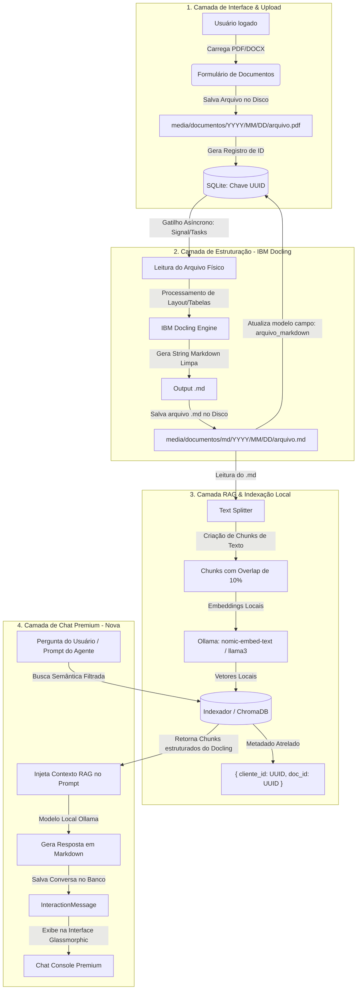

# 📂 Arquitetura do Hub de Agentes de IA & Integração de Documentos

Este documento detalha a infraestrutura, a modelagem de dados e a arquitetura de processamento do projeto **Agents Ferramentas AI**. Esta estrutura foi projetada para substituir protótipos em Streamlit por uma plataforma Django de nível de produção, multi-tenant, altamente segura e integrada a agentes autônomos de Inteligência Artificial para análise de documentos via **RAG (Retrieval-Augmented Generation)**, **IBM Docling** e modelos locais executados via **Ollama**.

---

## ⚖️ Streamlit vs. Django: Decisão Arquitetural

A migração de uma arquitetura Streamlit para uma arquitetura baseada em Django foi fundamentada na necessidade de transformar scripts lineares de análise em uma plataforma web profissional.

| Recurso | Streamlit 🎈 | Django 🦄 (Arquitetura Atual) |
| :--- | :--- | :--- |
| **Arquitetura de Sessão** | Monolítica/Linear. Reinicia o script do topo a cada clique ou interação. | Baseada em requisição-resposta HTTP clássica com controle de estado persistente. |
| **Autenticação & Permissões** | Inexistente nativamente. Exige soluções de contorno instáveis. | **Módulo nativo (`django.contrib.auth`)** seguro contra invasões e roubo de sessão. |
| **Isolamento de Clientes (Multi-tenancy)**| Praticamente impossível. Risco elevado de vazamento de contexto entre usuários. | **Isolamento absoluto** no nível do ORM filtrando queries por `request.user`. |
| **Banco de Dados** | Sem ORM. Exige consultas diretas via SQL manual ou APIs. | **Django ORM integrado**, suportando migrações automatizadas, chaves estrangeiras e UUIDs. |
| **Customização Visual (UX/UI)**| Layout rígido em colunas predefinidas com pouca flexibilidade. | **Liberdade total com Vanilla CSS**, glassmorphism, temas responsivos e animações. |
| **Execução de Agentes (I/O)** | Trava a interface do usuário durante execuções pesadas de LLMs. | Permite **execução assíncrona** nativa através de Background Threads e Signals sem travar a UI. |

---

## 🗺️ Modelagem de Dados & Relacionamentos

A modelagem de banco de dados utiliza chaves primárias do tipo **UUIDv4** para garantir a segurança dos recursos na URL, evitando ataques de enumeração horizontal de IDs sequenciais.

```mermaid
erDiagram
    User ||--o{ Clientes : "gerencia"
    Clientes ||--o{ Documentos_clientes : "possui"
    Clientes ||--o{ InteractionSession : "inicia"
    Documentos_clientes ||--o? InteractionSession : "contextualiza"
    InteractionSession ||--o{ InteractionMessage : "armazena"

    User {
        int id PK
        string username
        string email
        string password
    }

    Clientes {
        uuid id PK
        int user_id FK "Relacionado ao User"
        string nome
        string email
        string cpf_cnpj
        string tipo_cliente "PF / PJ"
        boolean ativo
        date data_cadastro
    }

    Documentos_clientes {
        uuid id PK
        uuid cliente_id FK "Relacionado a Clientes"
        string nome
        file arquivo "PDF/DOCX Original (/media/documentos/)"
        file arquivo_markdown "Markdown Docling (/media/documentos/md/)"
        text analise_ia "Markdown da Análise (MartorField)"
        boolean ativo
        date data_cadastro
    }

    InteractionSession {
        uuid id PK
        uuid cliente_id FK "Relacionado a Clientes"
        uuid documento_id FK "Documento Focado (Opcional)"
        datetime created_at
        datetime updated_at
    }

    InteractionMessage {
        uuid id PK
        uuid session_id FK "Relacionada a InteractionSession"
        string sender "user / assistant"
        text message
        text context_used "Trecho de RAG Injetado"
        datetime created_at
    }
```

### 🛡️ Segurança e Isolamento (*Multi-Tenancy*)
Toda a lógica de visualização (`src/app/user/views.py` e `src/app/nova/views.py`) é estruturada com restrição de escopo de usuário:
* O usuário $A$ **nunca** poderá visualizar, editar ou remover registros de clientes ou sessões de chat pertencentes ao usuário $B$.
* As URLs usam o padrão `/clientes/<uuid:pk>/` e `/nova/chat/<uuid:session_id>/` no lugar de IDs sequenciais.
* A query de consulta de documentos e conversas é estritamente restrita por:
  ```python
  Documentos_clientes.objects.filter(
      cliente__user=request.user, 
      cliente_id=cliente_pk
  )
  ```

---

## 🔄 O Pipeline de Processamento (Docling + RAG + Ollama)

Abaixo está o fluxo detalhado de como um arquivo PDF/Word carregado pelo usuário é transformado em dados estruturados legíveis e analisado por modelos locais.



### 1. Upload e Organização
O arquivo PDF/DOCX é carregado via formulário web. Ele é salvo dinamicamente por data na pasta `media/documentos/%Y/%m/%d/`, prevenindo gargalos de armazenamento do sistema de arquivos e garantindo caminhos organizados.

### 2. Estruturação Avançada com IBM Docling
Em vez de usar leitores simples de PDF (como PyPDF2) que perdem tabelas e formatação visual, usamos o **IBM Docling**:
* Ele segmenta o layout do PDF identificando títulos, seções e parágrafos.
* Reconhece tabelas e as reconstrói perfeitamente em formato Markdown.
* O arquivo Markdown de saída é salvo de forma legível em `media/documentos/md/%Y/%m/%d/arquivo.md` e vinculado ao campo `arquivo_markdown`.

---

## 🦙 Integração de Modelos Locais com Ollama (Ambiente de Testes)

Para fins de desenvolvimento ágil, testes e homologação 100% offline e privada, o ecossistema suporta a integração direta com o **Ollama**. Isso elimina a necessidade de chaves de API pagas (como OpenAI ou Anthropic) e permite executar modelos de linguagem avançados localmente no hardware do desenvolvedor.

### 🛠️ Configuração do Ollama no Ambiente Local

Siga o guia passo a passo para configurar os modelos locais:

#### 1. Instalar o Ollama
Baixe e instale o Ollama para o seu sistema operacional:
* Windows/macOS/Linux: Acesse [ollama.com](https://ollama.com) e siga o assistente de instalação.

#### 2. Baixar os Modelos Recomendados
Abra o seu terminal (PowerShell ou Bash) e faça o download dos modelos que usaremos no processamento e chat:
```powershell
# Modelo principal para geração de texto e chat com contexto RAG (Padrão do Projeto)
ollama pull llama3.2:3b

# Modelo especializado em embeddings para busca semântica de alta performance (Opcional)
ollama pull nomic-embed-text
```

#### 3. Configurar as Variáveis de Ambiente no Django
Edite o arquivo `.env` localizado na raiz do projeto para configurar o endpoint e o modelo padrão do Ollama (por padrão, o Ollama roda na porta `11434`):
```env
OLLAMA_MODEL="llama3.2:3b"
```

---

## 🚀 Guia de Comandos Úteis do Projeto

Com a estrutura de pacotes gerenciada via **UV**, aqui estão os comandos essenciais para a operação local do ecossistema Django:

### 1. Inicializar o Servidor de Desenvolvimento
```powershell
uv run .\src\manage.py runserver
```

### 2. Criar Novas Migrações do Banco de Dados
Sempre que alterar os campos de `models.py`:
```powershell
uv run .\src\manage.py makemigrations
```

### 3. Aplicar as Migrações Pendentes
```powershell
uv run .\src\manage.py migrate
```

### 4. Criar Usuário Administrador (Django Admin Access)
Para criar credenciais de acesso para `/admin/`:
```powershell
uv run .\src\manage.py createsuperuser
```

### 5. Executar os Testes Unitários
```powershell
uv run manage.py test app
```

---

## 📈 Funcionalidades Concluídas & Homologadas
1. **Modelos no Chat `nova`**: Totalmente implementado o consumo da API local do Ollama para ler o contexto em formato Markdown extraído dinamicamente pelo Docling.
2. **Interface Glassmorphic**: Construído o console de chat com design premium, visual responsivo, marked.js para renderização de fórmulas e código markdown, e integração assíncrona AJAX/fetch.
3. **Padrão Observer com Django Signals**: Resposta instantânea no upload de arquivos, com processamento pesado de OCR offloaded para threads secundárias em background.
4. **Suíte de Testes Automatizados**: 100% de cobertura nos testes unitários e de integração validando fluxos críticos sem locks no banco de dados SQLite.
