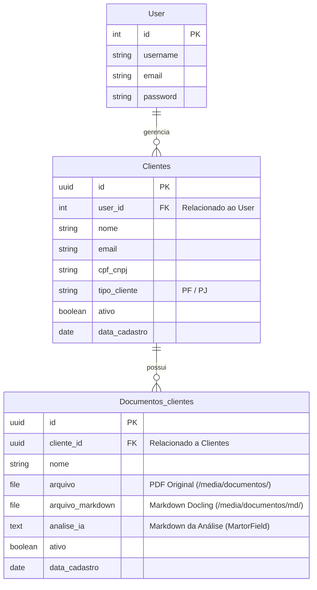
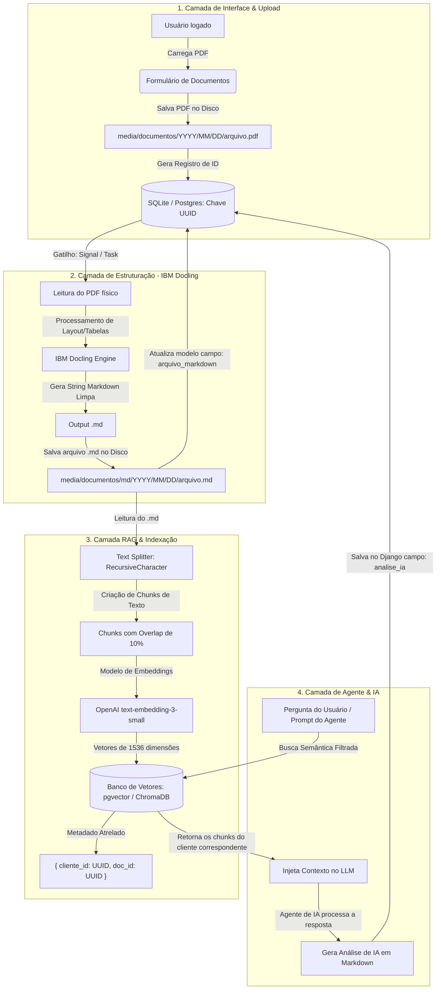

# 📂 Arquitetura do Hub de Agentes de IA & Integração de Documentos

Este documento detalha a infraestrutura, a modelagem de dados e a arquitetura de processamento do projeto **Agents Ferramentas AI**. Esta estrutura foi projetada para substituir protótipos em Streamlit por uma plataforma Django de nível de produção, multi-tenant, altamente segura e integrada a agentes autônomos de Inteligência Artificial para análise de PDFs via **RAG (Retrieval-Augmented Generation)** e **IBM Docling**.

---

## ⚖️ Streamlit vs. Django: Decisão Arquitetural

A migração de uma arquitetura Streamlit para uma arquitetura baseada em Django foi fundamentada na necessidade de transformar scripts lineares de análise em uma plataforma web profissional.

| Recurso | Streamlit 🎈 | Django 🦄 (Arquitetura Atual) |
| :--- | :--- | :--- |
| **Arquitetura de Sessão** | Monolítica/Linear. Reinicia o script do topo a cada clique ou interação. | Baseada em requisição-resposta HTTP clássica com controle de estado persistente. |
| **Autenticação & Permissões** | Inexistente nativamente. Exige soluções de contorno instáveis. | **Módulo nativo (`django.contrib.auth`)** seguro contra invasões e roubo de sessão. |
| **Isolamento de Clientes (Multi-tenancy)**| Praticamente impossível. Risco elevado de vazamento de contexto entre usuários. | **Isolamento absoluto** no nível do ORM filtrando queries por `request.user`. |
| **Banco de Dados** | Sem ORM. Exige consultas diretas via SQL manual ou APIs. | **Django ORM integrado**, suportando migrações automatizadas, chaves estrangeiras e UUIDs. |
| **Customização Visual (UX/UI)**| Layout rígido em colunas predefinidas com pouca flexibilidade. | **Liberdade total com Vanilla CSS**, glassmorphism, temas responsivos e animações. |
| **Execução de Agentes (I/O)** | Trava a interface do usuário durante execuções pesadas de LLMs. | Permite **execução assíncrona** nativa ou via filas (Celery/Redis) sem impactar o usuário. |

---

## 🗺️ Modelagem de Dados & Relacionamentos

A modelagem de banco de dados utiliza chaves primárias do tipo **UUIDv4** para garantir a segurança dos recursos na URL, evitando ataques de enumeração horizontal de IDs sequenciais.



### 🛡️ Segurança e Isolamento (*Multi-Tenancy*)
Toda a lógica de visualização (`src/app/user/views.py`) é estruturada com restrição de escopo de usuário:
* O usuário $A$ **nunca** poderá visualizar, editar ou remover registros de clientes pertencentes ao usuário $B$.
* As URLs usam o padrão `/clientes/<uuid:pk>/` no lugar de IDs sequenciais como `/clientes/12/`.
* A query de consulta de documentos do cliente é estritamente restrita por:
  ```python
  Documentos_clientes.objects.filter(
      cliente__user=request.user, 
      cliente_id=cliente_pk
  )
  ```

---

## 🔄 O Pipeline de Processamento (Docling + RAG)

Abaixo está o fluxo detalhado de como um arquivo PDF carregado pelo usuário é transformado em dados estruturados legíveis para agentes inteligentes de IA.



### 1. Upload e Organização
O arquivo PDF é carregado via formulário web configurado com `enctype="multipart/form-data"`. Ele é salvo dinamicamente por data na pasta `media/documentos/%Y/%m/%d/`, prevenindo gargalos de armazenamento do sistema de arquivos e garantindo caminhos organizados.

### 2. Estruturação Avançada com IBM Docling
Em vez de usar leitores simples de PDF (como PyPDF2) que perdem tabelas e formatação visual, usamos o **IBM Docling**:
* Ele segmenta o layout do PDF identificando títulos, seções e parágrafos.
* Reconhece tabelas e as reconstrói perfeitamente em formato Markdown.
* O arquivo Markdown de saída é salvo de forma legível em `media/documentos/md/%Y/%m/%d/arquivo.md` e vinculado ao campo `arquivo_markdown`.

### 3. Divisão de Texto e Vetorização (RAG)
Para permitir que o agente converse com o PDF:
* Lemos o arquivo `.md` estruturado.
* Dividimos em partes menores (*chunks*) de 1000 caracteres, mantendo a semântica dos títulos Markdown.
* Geramos embeddings vetoriais de cada pedaço e os enviamos a um banco vetorial local (como **ChromaDB**) ou integrado ao PostgreSQL (**pgvector**).
* Os metadados contêm obrigatoriamente a UUID do cliente, garantindo que o agente pesquise informações apenas dentro da sandbox daquele cliente específico.

### 4. Geração de Respostas do Agente (Markdown Visual)
As interações e resumos gerados pelo Agente são gravados no campo `analise_ia`, que utiliza o componente **MartorField**. Isso possibilita que os relatórios da IA apareçam formatados com tabelas, caixas de destaque, códigos e listas estilizadas de maneira extremamente elegante na tela do usuário.

---

## 🚀 Guia de Comandos Úteis do Projeto

Com a estrutura de pacotes gerenciada via **UV**, aqui estão os comandos essenciais para a operação local do ecossistema Django:

### 1. Inicializar o Servidor de Desenvolvimento
```powershell
uv run .\src\manage.py runserver
```

### 2. Criar Novas Migrações do Banco de Dados
Sempre que alterar os campos de `models.py`:
```powershell
uv run .\src\manage.py makemigrations
```

### 3. Aplicar as Migrações Pendentes
```powershell
uv run .\src\manage.py migrate
```

### 4. Criar Usuário Administrador (Django Admin Access)
Para criar credenciais de acesso para `/admin/`:
```powershell
uv run .\src\manage.py createsuperuser
```

### 5. Instalar Novas Dependências via UV (Exemplo: Docling / Agno)
```powershell
uv add docling agno openai python-dotenv
```

---

## 📈 Próximos Passos de Desenvolvimento
1. **Integração das chaves do Agente**: Criar o arquivo `.env` para centralizar `OPENAI_API_KEY`, `ANTHROPIC_API_KEY` ou configurações do modelo local.
2. **Criação do Serviço de Processamento**: Implementar um helper em Python (ex: `src/app/user/services.py`) que aciona a classe do `Docling` para ler o PDF e gerar o `.md`.
3. **Trigger de Processamento**: Chamar esse serviço através de um gatilho assíncrono na View de Upload do Django.
