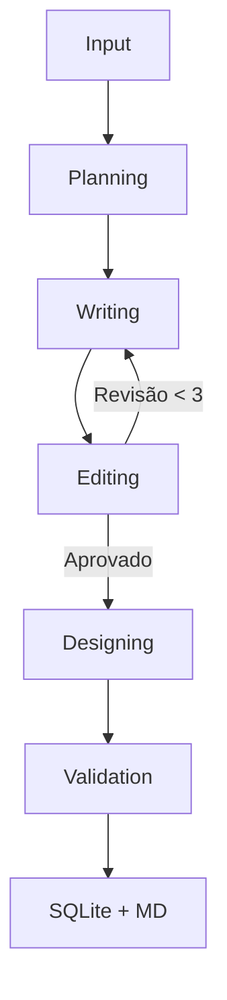

# Design System: Multi-Agent Blog Engine (Lean Elite Team)

Este documento detalha a arquitetura e as especificações técnicas para o sistema de criação de conteúdo técnico automatizado.

## 1. Visão Geral
O objetivo é criar uma operação de conteúdo enxuta onde agentes de IA independentes colaboram em um fluxo de trabalho estruturado para produzir artigos de alto valor com foco em SEO orgânico.

## 2. Princípios Arquiteturais (As 15 Leis)
1.  **Workflow Centralizado**: O LangGraph controla o fluxo; agentes apenas transformam o estado.
2.  **Contratos Rígidos**: Uso obrigatório de Pydantic para entradas e saídas.
3.  **Limite de Revisão**: `MAX_REVISIONS = 3` para evitar loops infinitos.
4.  **Prompts Modulares**: Separação de contexto permanente, transitório e resumido.
5.  **Observabilidade Total**: Log de tempo, tokens e sucesso por execução.
6.  **Desacoplamento de Prompts**: Agentes independentes sem dependência implícita.
7.  **RAG Adiado**: Foco primeiro no workflow e consistência.
8.  **Equipe Enxuta**: SEO, Writer, Editor, Designer, Validator.
9.  **Versionamento**: Armazenamento de revisões para auditoria editorial.
10. **Abstração de LLM**: Camada de provider para troca fácil de modelos.
11. **SEO Conservador**: Prioridade em intenção de busca e naturalidade.
12. **Interface Evolutiva**: Streamlit para MVP, FastAPI para escala.
13. **Camada de Serviços**: Separação clara entre Agentes, Serviços e Repositórios.
14. **Métricas de Qualidade**: Scores de clareza, SEO e coesão.
15. **Memória Editorial**: (Futuro) Histórico aprendido para consistência de estilo.

## 3. Arquitetura de Agentes (Powered by Agno)

| Cargo | Responsabilidade | Contrato de Saída (Schema) |
| :--- | :--- | :--- |
| **SEO Strategist** | Planning | `ContentPlan` (Outline, Keywords, LSI) |
| **Technical Writer** | Writing | `Draft` (Markdown, Summary, Technical Check) |
| **Editor** | Quality Review | `ReviewResult` (Approved: bool, Feedback: List[str]) |
| **Content Designer** | Visual Assets | `DesignPrompts` (Prompt List, Target Style) |
| **SEO Validator** | Final Audit | `ValidationScore` (Scores, Final Approval) |

## 4. Workflow (Powered by LangGraph)



## 5. Esquema de Dados (State)

```python
class AgentExecutionLog(BaseModel):
    agent_name: str
    execution_time: float
    token_usage: int
    success: bool

class AgentState(TypedDict):
    # Contexto
    topic: str
    keywords: List[str]
    
    # Artefatos (Pydantic Models)
    plan: ContentPlan
    content: str
    image_prompts: List[str]
    
    # Controle
    revision_notes: List[str]
    iteration_count: int
    logs: List[AgentExecutionLog]
    
    # Finalização
    is_validated: bool
    final_score: float
```

## 6. Persistência e Interface
- **Repository Pattern**: `src/database/repository.py` gerencia o SQLite.
- **Service Layer**: `src/services/` isola exportação e transformações complexas.
- **Streamlit**: Dashboard para leitura e monitoramento de logs.
