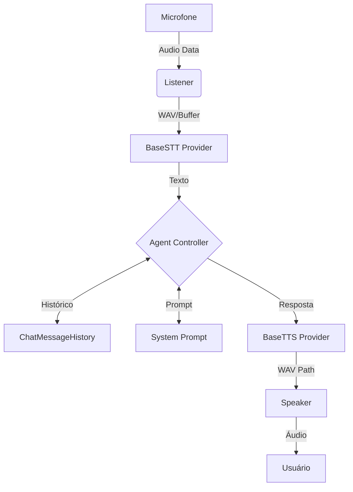

# 🎙️ Voice Agent "Nova" - Arquitetura Evolutiva (v2 Modular)

## 1. Visão Geral
A arquitetura da Nova evoluiu de um fluxo procedural para um sistema **Modular e Orientado a Interfaces**. Utilizamos **LangChain LCEL** para orquestração, garantindo que componentes de IA (LLM), Conversão (STT/TTS) e Hardware (Áudio) sejam independentes e fáceis de substituir.

## 2. Pilares Fundamentais (Refatorados)
- **Abstração Total:** Interfaces base em `app/core/base.py` definem o contrato para STT, LLM e TTS.
- **Agent Controller:** O "Cérebro" centraliza a lógica de prompt, memória de sessão e histórico usando LCEL puro.
- **Event-Driven UI:** O Estado (`AgentState`) notifica interessados (Dashboard) sobre mudanças, desacoplando a lógica da visualização.
- **Hardware Optimized:** Suporte nativo a GPU (GTX 1660 Super) via Docker NVIDIA Container Toolkit.

---

## 3. Fluxo de Execução Modular


---

## 4. Estrutura do Projeto (Atualizada)
```
nova-agent/
├── app/
│   ├── core/
│   │   ├── base.py           # Interfaces (BaseSTT, BaseLLM, BaseTTS)
│   │   ├── controller.py     # Lógica central LangChain LCEL
│   │   ├── engine.py         # Orquestrador Slim do ciclo de vida
│   │   └── state.py          # Estado compartilhado com Notificações
│   │
│   ├── providers/            # Implementações específicas (Plugins)
│   │   ├── stt_whisper.py    # Faster-Whisper (GPU Support)
│   │   ├── llm_ollama.py     # LangChain Ollama Wrapper
│   │   └── tts_piper.py      # Piper TTS Integration
│   │
│   ├── audio/                # Camada de hardware
│   │   ├── listener.py       # Captura Real-time (PyAudio)
│   │   └── speaker.py        # Reprodução (ffplay)
│   │
│   └── models/               # Configurações e Prompts
│       └── prompts/
│           └── system.md     # Personalidade da Nova
│
├── .agents/                  # Documentação de Gestão
│   ├── ARQUITETURA.md
│   └── STATUS.md
```

---

## 5. 📊 Observabilidade e Eventos
A lógica do agente dispara notificações automáticas no `AgentState`:
- **Engine** solicita mudança de status (`set_action`).
- **Módulos** reportam status de processamento e latência (`update_module`).
- **Dashboard** reage em tempo real (Refresh: 4fps).

---

## 6. Componentes Técnicos
- **Orquestração:** LangChain LCEL (`Prompt | LLM`).
- **STT:** `faster-whisper` (cuda enabled).
- **LLM:** `Llama-3.2-1B` via Ollama Local.
- **TTS:** `Piper` via terminal execution.
- **UI:** `Rich` (Terminal Dashboard).

---

## 7. Estratégia de Evolução
1. **Fase Atual (v2):** Arquitetura Modular concluída. Integração Hardware OK.
2. **Próximo Passo (RAG):** Adição de ferramentas de pesquisa e base de conhecimento.
3. **Escala:** Migração para LangGraph se a complexidade de estados aumentar.
